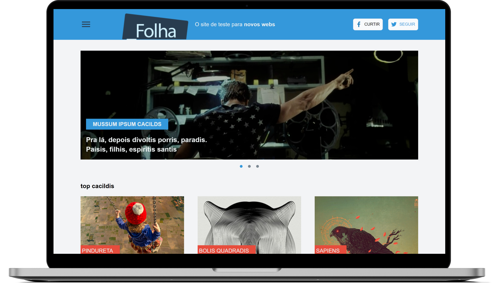
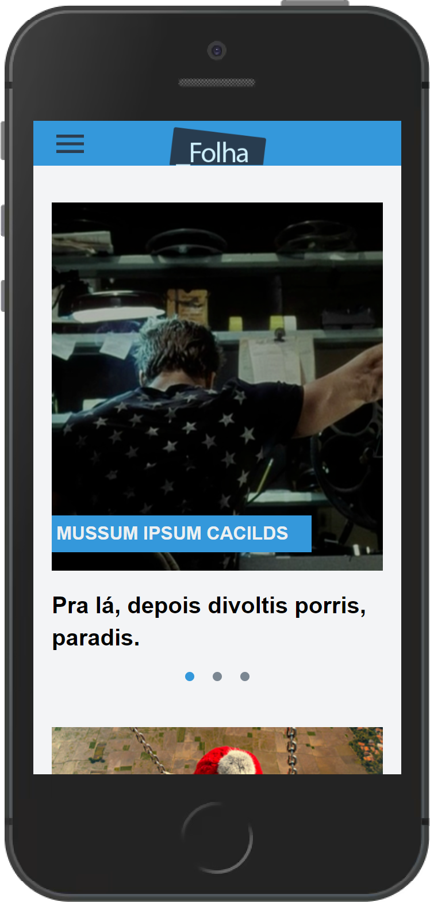

# Desafio FolhaSP - frontend

<p align="center">
    <a href="https://github.com/FolhaSP/teste-para-frontend">Acesse o desafio da Folha de São Paulo</a>
</p>

<p align="center">
  <a href="#ℹ-descrição">Descrição</a> •
  <a href="#-tecnologias">Tecnologias</a> •
  <a href="#-pré-requisitos">Pré-requisitos</a> •
  <a href="#-como-usar">Como usar</a>
</p>

<p align="center">
  </img>
</p>

<p align="center">
  </img>
</p>

## ℹ Descrição

Projeto desenvolvido como teste para recrumento de desenvolvedores frontend da FolhaSP.

O teste consistia em criar o HTML/CSS responsivo, com base no layout do Invision, para avaliar o nível de conhecimento de design responsivo usando HTML5, CSS3 e grids.

No entanto, serviu de prática para explorar sobre Svelte + SvelteKit (o equivalente a ReactJS + Next.js) e TailwindCSS.

## ⚒ Tecnologias

- [**Typescript**](https://www.typescriptlang.org)
- [**Svelte**](https://svelte.dev/)
- [**SvelteKit**](https://kit.svelte.dev/)
- [**TailwindCSS**](https://tailwindcss.com/)
- [**svelte-icons**](https://github.com/Introvertuous/svelte-icons)

## ⚙ Pré-requisitos

- [Git](https://git-scm.com)
- [npm e Node.js](https://nodejs.org/en/download/)
- Editor de código.

## 🖥 Como usar

**Clone o projeto e acesse a pasta**

```bash
$ git clone https://github.com/EduardoReisUX/folhaSP-frontend && cd folhaSP-frontend
```

**Siga os passos seguintes**

```bash
# Instale as dependências
$ npm install

# Inicie o desenvolvimento
$ npm run dev -- --open

# Para criar uma build da aplicação
$ npm run build

# Veja o preview dessa build
$ npm run preview
```

---

<p align="center">
    Made with 💜 by <a href="https://github.com/EduardoReisUX">Eduardo dos Reis</a>, powered by <a href="https://github.com/sveltejs/kit/tree/master/packages/create-svelte">create-svelte</a>
</p>
